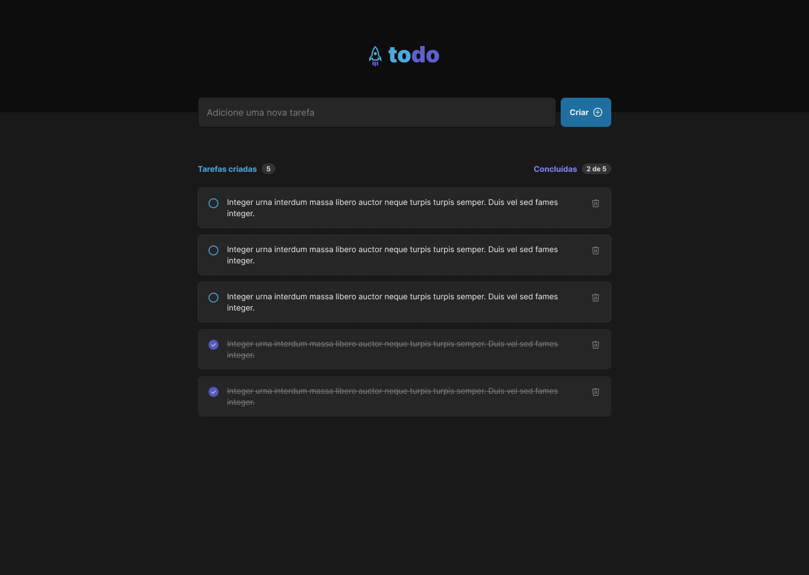

<h1 align="center"> Todo List </h1>

  Projeto desenvolvido como forma de praticar conceitos em <strong>React</strong>, <strong>TypeScript</strong>, <strong>Styled Components</strong> e outras tecnologias web modernas, com base na Formação de React da <strong>Rocketseat</strong>.

  <a href="#-tecnologias">Tecnologias</a>&nbsp;&nbsp;&nbsp;|&nbsp;&nbsp;&nbsp;
  <a href="#-projeto">Projeto</a>&nbsp;&nbsp;&nbsp;|&nbsp;&nbsp;&nbsp;
  <a href="#-layout">Layout</a>

 

  

## 🚀 Tecnologias

Este projeto foi desenvolvido com as seguintes tecnologias:

- **React JS**
- **TypeScript**
- **Styled Components**
- **Git e GitHub**
- **Figma**

## 💻 Projeto

O **Todo List** é uma aplicação criada para ajudar você a organizar suas tarefas diárias de forma eficiente. Com ele, é possível:

- Criar novas tarefas;
- Marcar tarefas como concluídas;
- Excluir tarefas que não são mais necessárias;
- Acompanhar o progresso das tarefas por meio de um contador, que exibe a relação entre tarefas concluídas e criadas.

<!-- - [Acesse o projeto finalizado, online](https://maykbrito.github.io/devlinks) -->

## 🔖 Layout

Você pode visualizar o layout do projeto através deste [**link no Figma**](https://www.figma.com/design/lwG7jwAiz2jzbXzpUhIthK/ToDo-List-•-Desafio-React?node-id=4130-459&t=6eSDpklRGbzqQkUW-0).  
É necessário ter uma conta no [**Figma**](https://figma.com) para acessá-lo.

<!-- ## :memo: Licença
Este projeto está sob a licença MIT. -->
---

  
  Feito por <strong>Gabriel João</strong>

